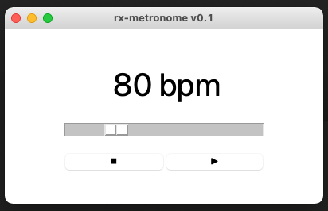

# rx-metronome

This is a python3/tk software aimed to be a simple metronome.

It features:
- Range from 40 to 218bpm
- Korg N1R Metronome Click wave sample (avaiable [here](https://freewavesamples.com/korg-n1r-metronome-click))

Dependences:
- py-simple-audio >= 1.0.4 

## Screenshots

